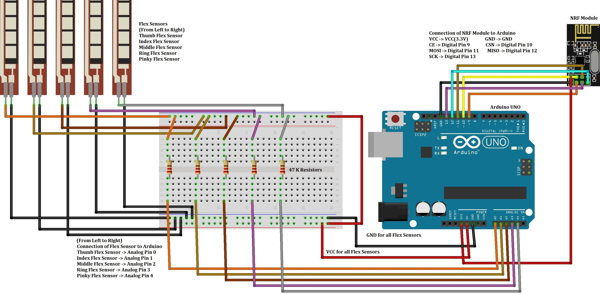
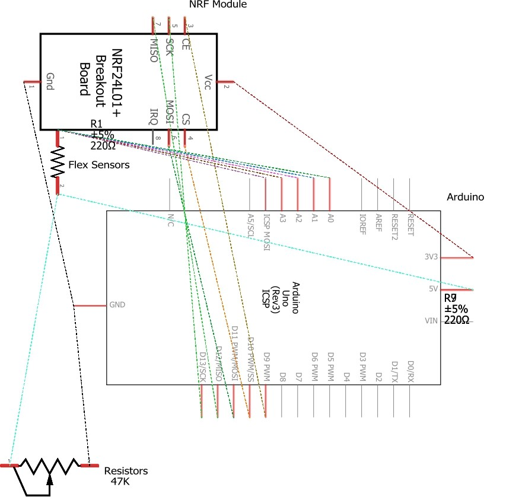
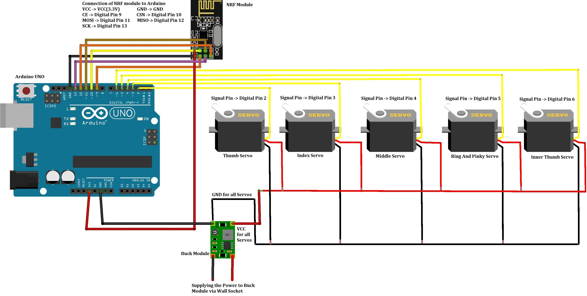
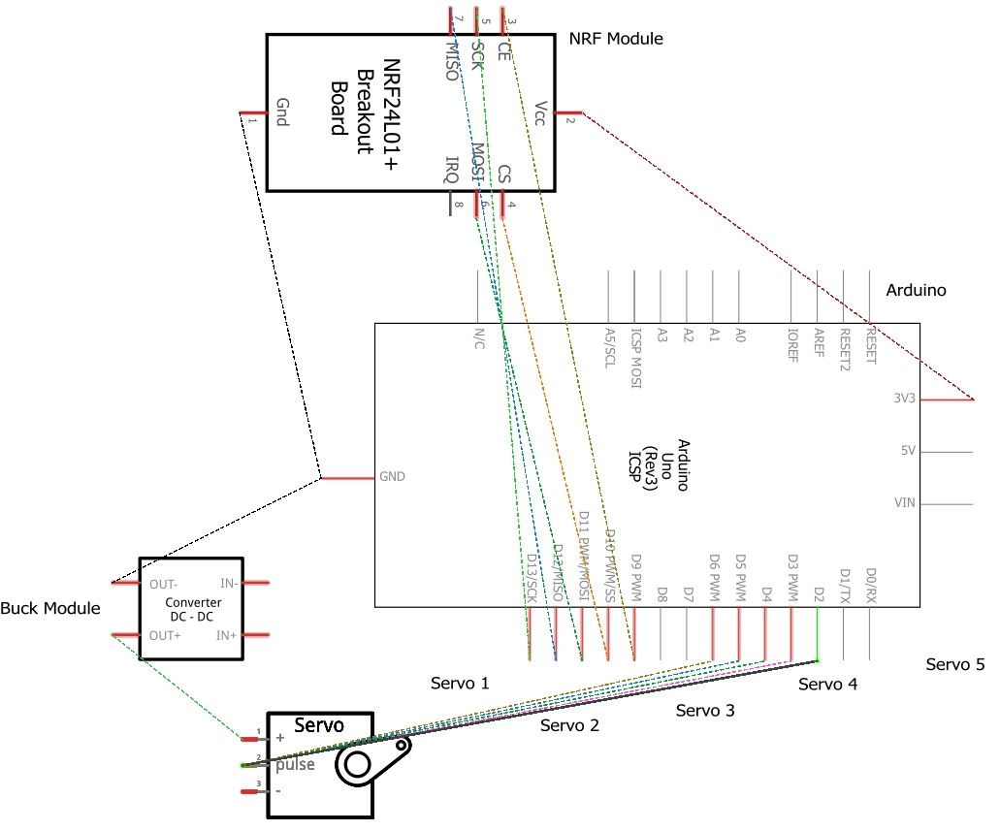
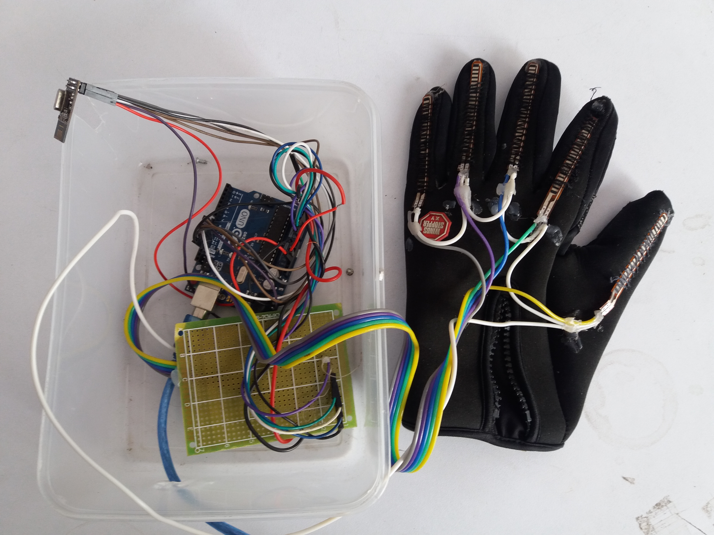
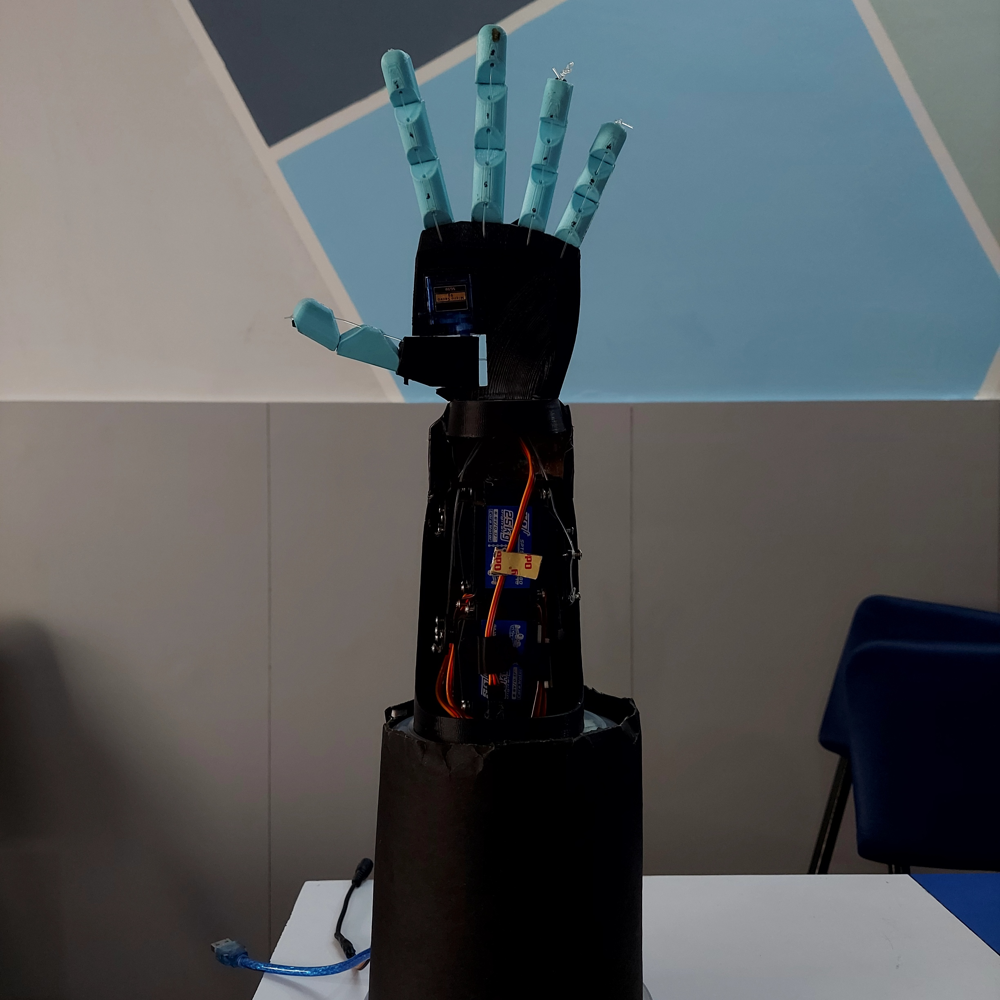
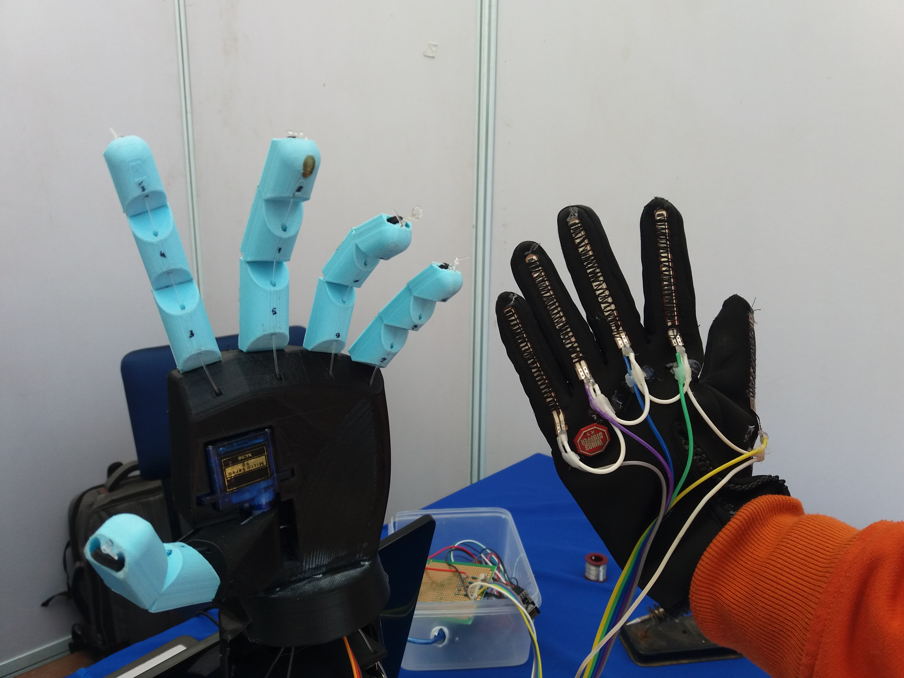
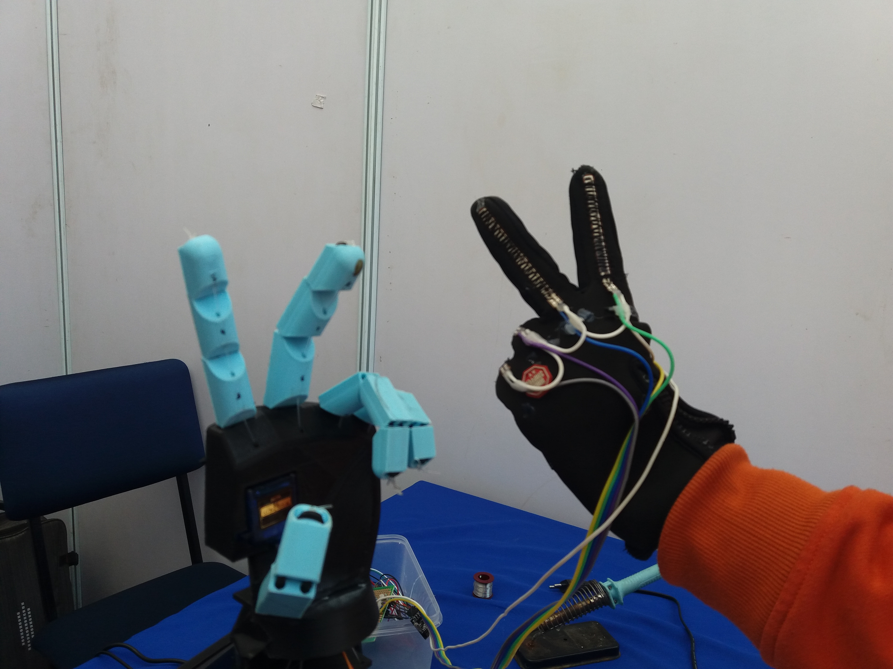
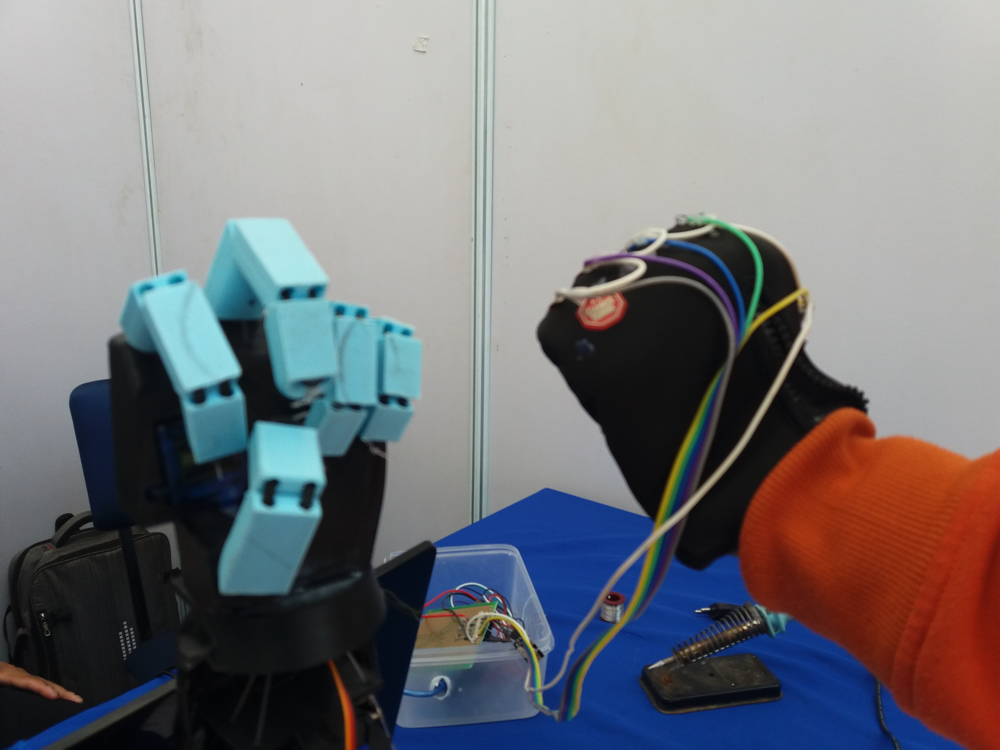

# Humanoid Arm

The main aim of this humanoid arm is to assist individual who have to perform precise and difficult task using their hands in various sectors like Industries, Hospitals and Chemical Labs.
Hardware Used:

1. 3D Printer and Filaments
2. Rubber Band
3. Fishing Line
4. Servo Motor
5. Buck Module
6. Flex Sensor
7. Gloves
8. Networked Radio Frequency (NRF)
9. Arduino
10. Jumper Wires
11. 47K resistors
12. M3 Screw Assortment
13. Matrix Board

Software Used :

1. Arduino IDE and NRF Library
2. Fritizing

Since there are both master and slave arm so the circuiting for each arm has to be done.
The circuit diagram for the master arm is ;  
Circuit Diagram

 
Schematic Diagram

The circuit diagram for the slave arm is ;

 
Schematic Diagram

Integration
Since, the main aim of the arm is to assist any individual for performing difficult and precise task it can be integrated in various scopes and sectors like; 
Hospitals  
a. For carrying out surgeries that takes long period of time to complete.  
b. Using to perform precise and complicated surgeries where human hand feels difficult to work directly. 
Factories 
a. Performing risky and tedious tasks in the manufacturing units due to which the workers are not injured and can perform other simpler tasks. 
b. Lifting heavy goods and carriages via the mimics done by the human in lighter ones. 
Chemical Laboratories  
a. Handling various kinds of chemicals which might injure the humans when used via hands. 
b. Carrying out all the tasks that is difficult for the humans to perform. 
 
Privacy and Ethics  
Despite the integration of the arm in various scopes and sectors, there are certain ethical considerations due to which the arm cannot be used directly without the proper ethical approval.  
a. To use the arm for carrying out surgeries in the hospitals at first the arm must be examined properly on its movement and actions. Then it should be approved with the proper verification because while doing surgeries the life of the patient is under risk and if something wrong happens then who will be responsible for that. So, the use of arm in hospitals might not be feasible. 
b. Similarly, if the arm gets used excessively in the industrial areas than the workers who earn money to regulate their daily life might lose the job and face many problems. To control this the arm should only be used where the workers find difficult to work rather than using it for all purposes.  
 
Limitations  
Though the developed arm can be integrated in the various scopes and situations, there are still certain limitations which are presented as; 
a. Since, the arm is controlled via the master arm so, it does not have any kind of self-intelligence via which it can perform action of its own. 
b. For triggering the movement of the master arm in the humanoid arm, flex sensors are used which might not work properly and give precise value after the long period of time.  
c. The servo motors used for performing the movement of each part of the arm are of high power and equipped with the capacity to lift up to 25 KGs of load. So, an external buck module is required for powering them. 
 
Future Work 
Beside the limitations of the arm, there are certain future work that can be carried out so as include new features and enhance its productivity; 
a. Using of Automated Artificial Intelligence to make the humanoid arm self-sufficient to perform tasks independently. 
b. Developing the whole hand up to the shoulder and integrating Gyro-sensor for moving the wrist as well as the elbow of the hand. 
c. Deploying the whole arm as bionic arm and using it for assisting the various kinds of disabled individual who don’t have hands. 

Group Members :  
Anush Gajurel 
Ujjwal Humagain 
Pukar Subedi 
Jay Ram Pandey 
Dipesh Lama 

The final setup for both the arm is presnted in the figure as;  
Master Arm

Slave Arm

The arm can also perform other movements which are shown as; 

And rest of the demonstration is shown
in the YouTube Video. The link to the YouTube video is given as : https://youtu.be/vp6CRa2nmLc
